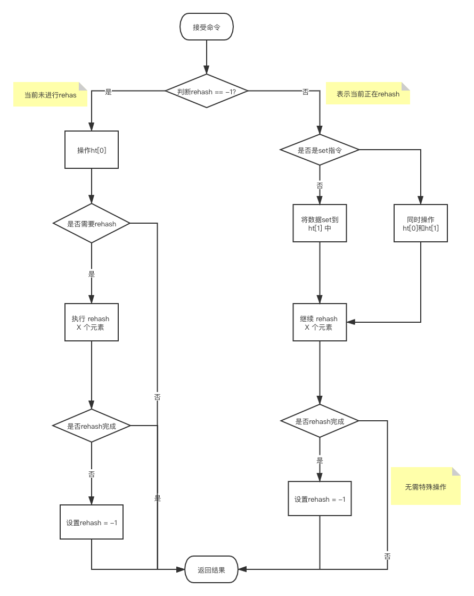

# 动态字符串

### 定义结构

```go
 
package xxx

type Sdshdr struct {
    buf      []byte
    encoding uint8
    len      []byte
    alloc    []byte
}

```
* buf 保存的数据 二进制
* len 已经分配的内存的总长度
* alloc 已经使用的长度
* encoding 表示 len 和 all 用 uint8、uint16、uint32、uint64 的哪一个表示 
   * 1 : uint8
   * 2 : uint16
   * 3 : uint32
   * 4 : uint64
  
当 encoding 为 1 时 len 的长度为1 使用时转成uint8 使用，统一对外转成uint64 alloc 与 len 一样
当 encoding 为 2 时 len 的长度为2 使用时转成uint16 使用，统一对外转成uint64 alloc 与 len 一样

### 新建

所有数据均为nil 不分配内存空间

### 接受参数新建

buf 保存数据

当 len 小于 1M 时 alloc = 2 * len

当 len 大于等于 1M 时 alloc = len + 1M

### 其他操作

按照普通二进制处理即可，如有转成string 用UTF-8编码

# 链表 

按数据结构双向链表功能实现

链表定义:
```go
package xxx

type ListNode struct {
    prev  *ListNode
    next  *ListNode
    value interface{}
}

type List struct {
    head *ListNode
    tail *ListNode
    len  *uint64
}
```
len 直接定义为uint64 是因为 链表长度较小时采用压缩列表存储

# 字典

按算法导论中 字典 表实现

结构定义
```go
package xxx

type DictEntry struct {
    key   interface{}
    value interface{}
    next  *DictEntry
}

type DictHt struct {
    table []DictEntry
    // table 长度
    size  uint64
    // 元素个数   注意这里的命名与redis源不一样 在redis源码里用used 
    // 为了保持所有数据结构保持一致所以使用 len
    len  uint64
}

type Dict struct{
    ht [2]DictHt
    //当rehash 不在进行时该值为-1
    rehash int8
}
```

hans 算法用 murmurhash 算法，

收缩扩展算法
* 总的前提条件 当字典表不在进行 rehash 时
  * 扩展条件 ht[0].len / ht[0].size > 1
  * 收缩条件 ht[0].len / ht[0].size < 0.1
* ht数组长度为2 将ht[0]扩展到ht[1]
  * 扩展操作，ht[1]的大小为第一个大于等于ht[0].len*2 的 2的n次方幂，
  比如ht[0].len=4 4*2=8 8恰好是第一个大于等于8 2的n次方，所以ht[1]的table 大小设置为8
  比如ht[0].len=5 5*2=10 第一个大于10的2的n次方为16，所以ht[1]的table 大小设置为16
  * 压缩操作时， ht[1]的大小为第一个大于等于ht[0].len 的 2的n次方幂。
  * 实际操作时简化操作，table 初始化的大小为16，扩展式将table大小 扩展为2倍 压缩时将 table大小缩小一般。
  最小为16，这个16可以做成一个配置参数，需要转换为2的n次方的值
  
* 渐进式 rehash
为了防止字典很大是 rehash 时间太长 
在 rehash 中 rehash字段设置为0
在 rehash 过程中ht[0]和ht[1]都有值 所以在操作dict时需要都操作ht[0]和ht[1]
一次操作字典表 rehash 一部分 下一次操作在 rehash 一部分。多次操作字典表最终将ht[0]全部迁移至ht[1]，用h[1]替换ht[0] 
rehash字段设置为-1 全部 rehash 完成

* 添加数据及 rehash 过程



# 跳跃表

# 整数集合

# 压缩列表

# 快速链表
