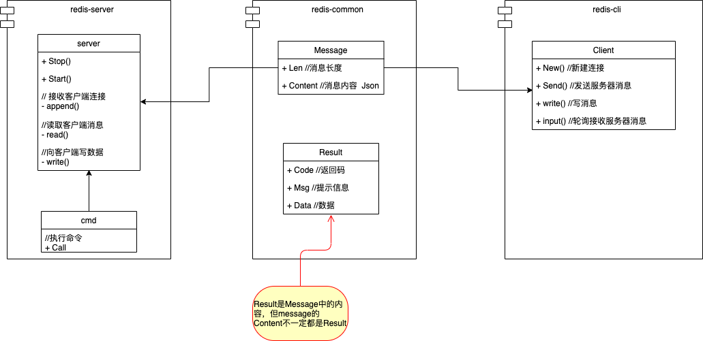

# 项目架构图


* redis-common 提供公共结构体定义
* redis-cli 客户端
* redis-server 服务端

# 服务器与客户端通信过程


# 服务器与客户端通信类图



# 通信协议

整个通信采用 tcp 长连接模式，协议采用 protocol 协议

- protocol 协议

整个数据以二进制为基础

4 位 header 表示消息长度

```go
package xxx

//数据包定义
type Message struct {
    ID      uint64 // 消息ID
    Content string // 消息内容
}

```

* Content 消息为字符串格式，如果是对象采用json序列化